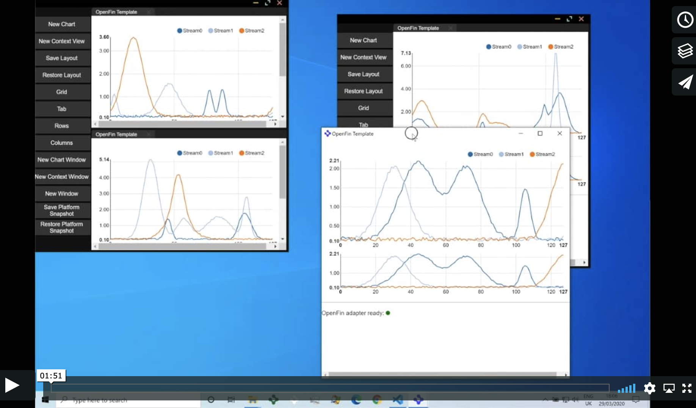
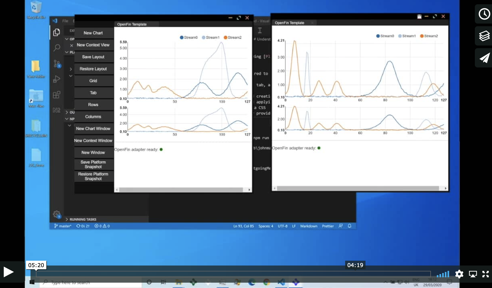

# Platform API Project Seed

This project seed includes the following [Platform API](https://openfin.co/platform-api) capabilites:

* Examples of the configuration required to use the Platform API and apply customizations
* Usage of the Platform API to group, tab, and rearrange application windows
* API examples of View management and creation
* API examples of Snapshot saving and applying
* Examples of visual customization via CSS
* Examples of visual customization by providing a custom Platform Window
* Examples of behavioral customization by overriding the Platform APIs
* Examples of how to make use of the platform apis to treat views inside of a window as a group with shared context and how messages could be shared to views in a group and how you can maintain that relationship when you pull out a view from a window (so there is a linked relationship).
* How your view can make use of knowledge of it being moved from window to window and how it can keep track of the number of views that exist so it can react to that.
* How you can lock all the views on a window (to prevent views from being pulled out or views dragged in and to also hide the tabs if they are not needed).
* How you can pin platform windows so they are always on top.

[Launch in OpenFin](https://openfin.github.io/start/?manifest=https%3A%2F%2Fopenfin.github.io%2Fplatform-api-project-seed%2Fpublic.json)

## How to use this repository:

* Clone this repository
* Install the dependencies: `npm install`
* To launch the default application: Start the live-server and launch the application: `npm start`
* To launch the main window application: Start the live-server and launch the application: `npm run mainwindow`

## Understanding the code

### Platform configuration
* [Platform configuration](https://developers.openfin.co/docs/platform-api#section-1-launching-a-platform) has been included in the provided [app.json](app.json) file.
* The [defaultWindowOptions](https://developers.openfin.co/docs/platform-api#section-standard-window-customization) key in the provided `app.json` will instruct the platform to replace our Standard Window with the provided [platform-window.html](platform-window.html) file.
* The [commands](https://developers.openfin.co/docs/platform-api#section-5-3-using-keyboard-commands) key in the provided `app.json` will allow keyboard access to the next tab command.
* The [providerUrl]() key in the provided `app.json` will allow you to make custom changes to the Platform APIs, by pointing to a hosted [provider.html](provider.html) file. (STARTING IN v15.80.50.x)

### CSS Customization
* A [stylesheet](https://developers.openfin.co/docs/platform-api#section-standard-window-customization) is linked in the [platform-window.html](platform-window.html) file, and allows for [visual customization](styles/frame-styles.css). For a complete view of all properties, please refer to the [example stylesheet](https://github.com/openfin/layouts-v2-style-examples)

### Platform Window
The [platform-window.html](platform-window.html) file contains the [layout-container](https://developers.openfin.co/docs/platform-api#section-5-2-complete-window-customization) element and two custom elements: `left-menu` and `title-bar`. These elements, in conjunction with the [js/left-menu.js](js/left-menu.js) and [js/title-bar.js](js/title-bar.js) files, enable the following functionality:
The [platform-window.html](platform-window.html) file contains the [layout-container](https://developers.openfin.co/docs/platform-api#section-5-2-complete-window-customization) element and two custom elements: `left-menu` and `title-bar`. These elements, in conjunction with the [js/platform-window.js](js/platform-window.js) file, enable the following functionality:

##### left-menu
Provides examples of the following functionality:
* Adding a View to an existing Window
* Adding a View that makes use of shared context if there is more than one view of that type
* Adding a View in a new Window
* Creating a regular OpenFin Window
* Saving/Restoring Platform Snapshots
* Applying a preset arrangement on the current window (Grid, Tabs, Rows, Columns)
* Added a view New View Tab Example that showed a way of preventing specific tabs from being moved or closed (this is just to give an idea of an approach if needed)

##### title-bar
Provides examples of the following functionality:
* Draggable area
* Save/Restore a layout
* Lock/Unlock the current layout
* Pin/Unpin window so it is always on top
* Close/Maximize/Minimize buttons

### Provider
Our [custom Provider](js/platform-provider.js) includes an [extension](js/external-window-snapshot.js) that will look for a pre-configured list of [externalWindows](https://cdn.openfin.co/docs/javascript/15.80.49.21/ExternalWindow.html) (the default being the provided [my_platform_notes.txt](my_platform_notes.txt) file opened in notepad.exe) and:

* Override `getSnapshot` to include a [externalWindows](https://cdn.openfin.co/docs/javascript/15.80.49.21/ExternalWindow.html) section containing information on any any external window included in the configuration.
* Override `applySnapshot` to look for an [externalWindows](https://cdn.openfin.co/docs/javascript/15.80.49.21/ExternalWindow.html) section and restore the position and state of any external window included in the configuration.

## Understanding the second example- Main Window Example

This is similar to the main example but is configured to act like an application that has a main window and child windows that may or may not use the platform layout.

This example also shows how you can automatically capture layout when the main window closes (to local storage but it could be any store) and have the main window support a layout but not close if the last view is removed.

### Platform configuration
* [Platform configuration](https://developers.openfin.co/docs/platform-api#section-1-launching-a-platform) has been included in the provided [app-window-main.json](app-window-main.json) file. This config does not include a default window as this is managed by the custom provider: [provider-window-main.html](provider-window-main.html)
* The [defaultWindowOptions](https://developers.openfin.co/docs/platform-api#section-standard-window-customization) key in the provided `app-window-main.json` will instruct the platform to replace our Standard Window with the provided [platform-window-common.html](platform-window-common.html) file for new windows.
* The [commands](https://developers.openfin.co/docs/platform-api#section-5-3-using-keyboard-commands) key in the provided `app-window-main.json` will allow keyboard access to the next tab command.
* The [providerUrl]() key in the provided `app-window-main.json` will allow you to make custom changes to the Platform APIs, by pointing to a hosted [provider-window-main.html](provider-window-main.html) file. (STARTING IN v15.80.50.x)

### CSS Customization
* A [stylesheet](https://developers.openfin.co/docs/platform-api#section-standard-window-customization) is linked in the [platform-window-common.html](platform-window-common.html) file, and allows for [visual customization](styles/frame-styles.css). For a complete view of all properties, please refer to the [example stylesheet](https://github.com/openfin/layouts-v2-style-examples)
* A [stylesheet](https://developers.openfin.co/docs/platform-api#section-standard-window-customization) is linked in the [platform-window-main.html](platform-window-main.html) file, and allows for [main window visual customization](styles/frame-styles-window-main.css) with some additional classes that only apply to the main window. For a complete view of all properties, please refer to the [example stylesheet](https://github.com/openfin/layouts-v2-style-examples)

### Platform Window Common
The [platform-window-common.html](platform-window-common.html) file contains the [layout-container](https://developers.openfin.co/docs/platform-api#section-5-2-complete-window-customization) element and one custom element: `title-bar-common`. This element, in conjunction with the [js/title-bar-common.js](js/title-bar-common.js) file, enable the following functionality:

##### title-bar-common
Provides examples of the following functionality:
* Draggable area
* Save/Restore a layout
* Lock/Unlock the current layout
* Pin/Unpin window so it is always on top
* Clone the current window (experimental)
* Close/Maximize/Minimize buttons

### Platform Window Main
The [platform-window-main.html](platform-window-main.html) file contains the [layout-container](https://developers.openfin.co/docs/platform-api#section-5-2-complete-window-customization) element and two custom elements: `left-menu` and `title-bar-main`. These elements, in conjunction with the [js/left-menu.js](js/left-menu.js) and [js/title-bar-main.js](js/title-bar-main.js) files, enable the following functionality:

##### left-menu
Provides examples of the following functionality:
* Adding a View to an existing Window
* Adding a View that makes use of shared context if there is more than one view of that type
* Adding a View in a new Window
* Creating a regular OpenFin Window
* Saving/Restoring Platform Snapshots
* Applying a preset arrangement on the current window (Grid, Tabs, Rows, Columns)
* Added a view New View Tab Example that showed a way of preventing specific tabs from being moved or closed (this is just to give an idea of an approach if needed)

##### title-bar-main
Provides examples of the following functionality:
* Same button functionality as title-bar-common (except clone)
* When you close the window it saves a snapshot of the layout for all windows before closing the whole application.
* If the window is being closed because you have dragged the last view out of the main window into another window it adds a default view and doesn't close the window. If you want to have layout support in the main window then you must have at least one default view that you always want displayed or you have a main window without layout support.
* If only one view remains in the main window then it removes the close icon via the custom class in the [main window visual customization](styles/frame-styles-window-main.css) stylesheet and removes it when more than one view exists.

### Provider
Our [custom Provider](js/platform-provider.js) includes an [extension](js/external-window-snapshot.js) that will look for a pre-configured list of [externalWindows](https://cdn.openfin.co/docs/javascript/15.80.49.21/ExternalWindow.html) (the default being the provided [my_platform_notes.txt](my_platform_notes.txt) file opened in notepad.exe) and:

* Override `getSnapshot` to include a [externalWindows](https://cdn.openfin.co/docs/javascript/15.80.49.21/ExternalWindow.html) section containing information on any any external window included in the configuration.
* Override `applySnapshot` to look for an [externalWindows](https://cdn.openfin.co/docs/javascript/15.80.49.21/ExternalWindow.html) section and restore the position and state of any external window included in the configuration.

We also include an additional script [custom Provider Window Main](js/platform-provider-window-main.js) that:

* Checks for the last saved snapshot
* If retrieved, clears it and uses the local copy to launch the last saved set of windows
* If there is no snapshot it uses a default snapshot

